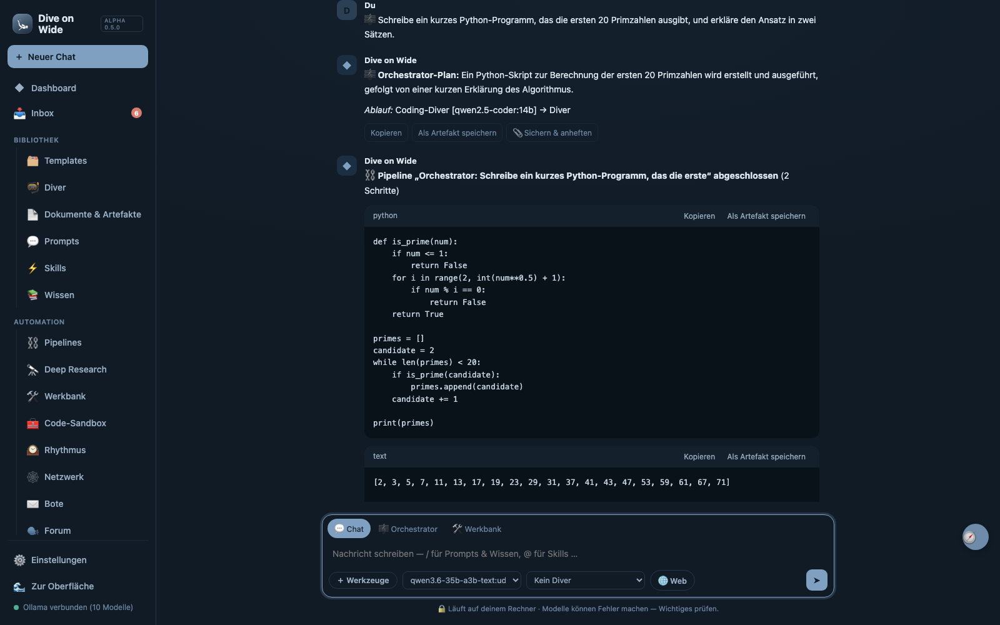
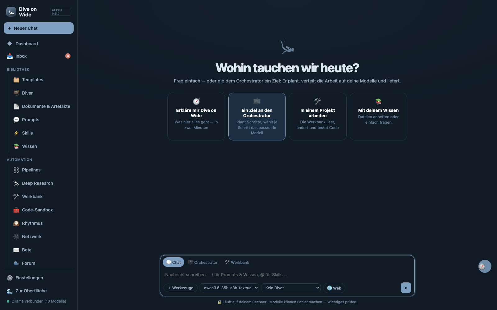
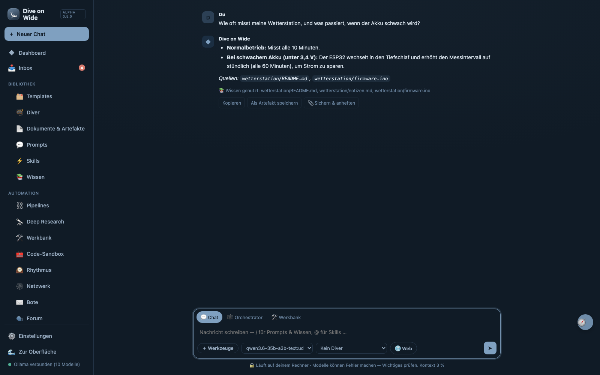
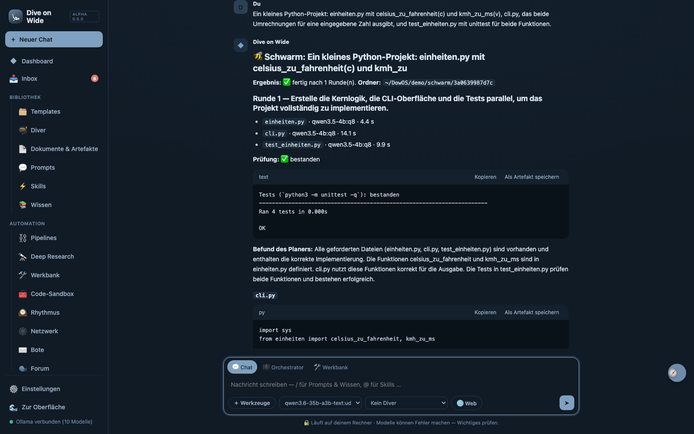
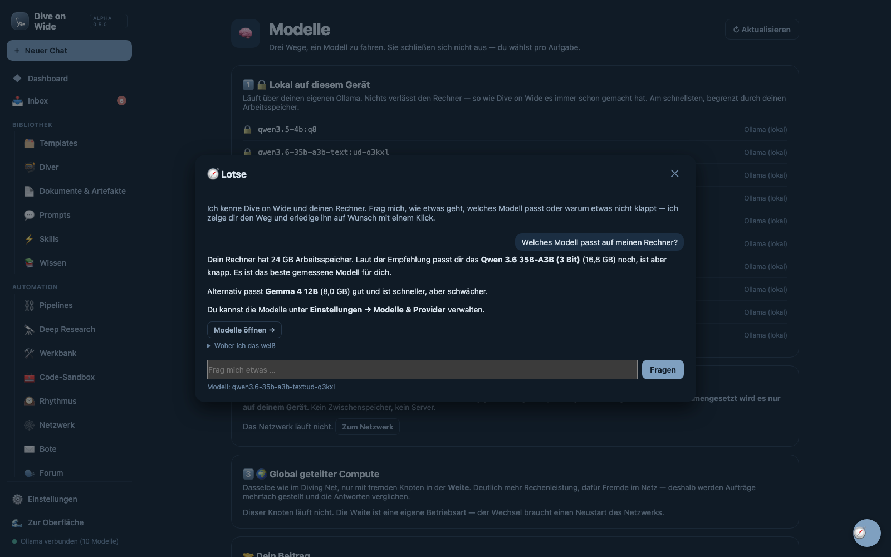

# Dive on Wide — a local AI agent workspace

**Not another chat window. A workspace where your local models actually do
things: plan one task across several models, write and run code, research the
web, drive your real screen, and — optionally — pool memory with your own
machines over an encrypted peer-to-peer mesh that keeps nothing on disk.**

**32,014 lines of pure Python standard library and one vanilla-JS file. No pip,
no npm, no Docker, no API key, zero dependencies — `python3 server.py` and it
runs.** Every capability that touches your machine, your network or your data
ships switched **off**, and every diagnosis says what is actually missing rather
than failing quietly.

[](tests/run_tests.py)
[-blue)](https://www.python.org/)
[](server.py)
[](LICENSE)
[](#known-limitations)

> **Experimental software (alpha). Use at your own risk** — no warranty of any kind; see
> [LICENSE](LICENSE). Dive on Wide can run code, control your mouse and keyboard and reach the
> network once you switch those on; read what each switch does before you do.

Everything runs on your machine and talks to your local [Ollama](https://ollama.com) (or any OpenAI-compatible endpoint). No cloud is required, no API key is required, nothing leaves the box unless you explicitly switch a cloud provider on.

> **About the name:** **Dive on Wide** means: stay curious, and keep going deeper into a thing. That is the whole idea: the diver, the colours, and the two themes ("the surface" and "the deep") all come from it.
>
> It is a program you start that opens in your browser — not an operating system, no kernel, no bootable image. See [Known limitations](#known-limitations).

<p align="center">
  
</p>

<sub><b>One goal, two models, working code.</b> Planned by Qwen 3.6 35B-A3B, coded and run by qwen2.5-coder 14B, explained by the planner again — 70 seconds on a MacBook with 24 GB. The swarm below needed 36 seconds for three files and four passing tests.</sub>

<p align="center">
  
  
  <br>
  
  
</p>

<sub>Real screenshots of a running instance (German interface; it also speaks English) — nothing staged. Top left:
the start page. Top right: three files dropped into Knowledge, the chat finds them by itself and says which it used.
Bottom left: a swarm of three small models building a Python project with tests. Bottom right: the guide (🧭).</sub>

---

## Quick start

Download a package from **Releases** (or the code as ZIP), unpack it, then:

- **macOS:** double-click `Dive on Wide starten.command` (the first time macOS blocks files from the internet: right-click → Open → Open)
- **Windows:** double-click `Dive on Wide starten.cmd`
- **Linux:** `./start.sh` (or `python3 server.py`)

The app opens in your browser at `http://localhost:3000`. You need Python 3.9+ and, for local models,
[Ollama](https://ollama.com). The file `dowos` is the terminal tool for scripts and agents, not the app starter.

## Install — one file, three systems

```bash
python3 install.py            # set up, or update an existing install
```

On **macOS and Linux** `sh install.sh` works too; on **Windows**
`powershell -ExecutionPolicy Bypass -File install.ps1`. Both do almost nothing:
check for Python, fetch `install.py`, hand over. The installer itself is **one
file of pure standard library** — you can read it before you run it.

| | |
|---|---|
| `python3 install.py` | set up, or update an existing installation |
| `--pruefen` | only look: what is here, what is missing — touch nothing |
| `--alles` | also offer the optional parts (distributed compute, screen control) |
| `--von package.zip` | from a local package instead of the network |
| `--ziel DIR` | where to put it (default: `~/DowOS`) |

**It installs nothing without asking.** Every step prints the exact command it
is about to run, in plain text, before running it. Say no and it tells you at
the end which capability you are missing. An installer that quietly drives
package managers and collects system privileges would be the opposite of what
Dive on Wide promises.

**It never pipes code from the network into a shell.** For Ollama on Linux it
prints a two-step recipe instead — download, read, then run. `curl … | sh`
executes code nobody has looked at.

**Running it again is the update.** It fetches the newest version and leaves
`storage/` and your `.env` untouched — an update that clears your own chats is
not an update.

What it sets up: Python 3 (checks only — a running Python cannot replace
itself), **Ollama** for the models, **git** and **cmake**, on request
**llama.cpp with RPC** for distributed inference (built from source, about ten
minutes), and **screen control** (`cliclick` / `xdotool`+`maim`).

Afterwards: `~/DowOS/dowos` on macOS and Linux, **"Dive on Wide starten.cmd"** on
Windows, then **http://localhost:3000**.

### Uninstall

```bash
python3 install.py --entfernen          # Windows: py install.py --entfernen
```

Quit Dive on Wide first. The installer backs up your data (`storage/`, `.env`) to a zip next to the
installation, then asks for each part separately: the installation folder, `~/.dowos` (self-built
llama.cpp), `~/.dowos-browserprofil`. It refuses anything that is not a Dive on Wide installation (your home
folder, a Git working copy). Kept on purpose: programs installed with your consent (Ollama, git, …) and
your Ollama models. Dive on Wide creates no autostart entries and changes nothing else on the system.

### Honest testing status

Developed and measured on **macOS** (Apple Silicon). Since then:

- **Linux** — first real run in an Ubuntu 26.04 VM (27.09.2026): installer,
  first-time setup, bubblewrap sandbox, a consumer project. Details in
  [`docs/ABNAHME.md`](docs/ABNAHME.md).
- **Windows** — first real run in a Windows 11 Pro (25H2, ARM64, German) VM
  (29.09.2026): the full test suite passes (492 tests, 7 skipped with a stated
  reason), first-time setup through the real UI, chat, code sandbox and the
  Werkbank agent on a project in a folder with an umlaut. The run found and fixed
  a string of Windows-only bugs — among them one where **no path rule applied on
  Windows** ([`docs/SICHERHEIT.md`](docs/SICHERHEIT.md), finding 13). Not tested:
  an Nvidia/CUDA machine, x64 hardware (the VM is ARM64).

**Windows, plainly:** there is no built-in sandbox for the agent's commands, so
the Werkbank asks you to approve **every** command. The test bench, DowBench and
distillation (they run foreign code only inside a sandbox) and training (Apple
Silicon only) are not available there. For more protection run Dive on Wide in WSL2
([`docs/VM_BETRIEB.md`](docs/VM_BETRIEB.md)) — written, **not yet tested**: WSL2 needs nested
virtualisation, which the test VM on a Mac cannot provide; that takes a real Windows PC.

---

## Why this and not Open WebUI / LM Studio / Jan?

Those are excellent chat frontends for local models. Dive on Wide is a different thing: a **workspace where local models do work**, not just talk.

| | Dive on Wide |
|---|---|
| **Multi-model workflows** | Every step of a workflow can run on its own model at its own provider. The orchestrator picks the models itself and tells you why. |
| **The orchestrator** | Describe a goal in plain language; it plans a workflow from the available building blocks, casts the roles, runs it, and answers in chat. |
| **Persistent local memory** | "The Flow": every action → artifact → inbox → Second Brain → Evolver. The system gets to know your work and condenses it. |
| **Computer use, with brakes** | It can actually operate your machine — off by default, owner-only, per-action confirmation, kill switch. |
| **Zero dependencies** | One `server.py`, one `index.html`, the Python stdlib. Nothing to install, nothing to break, easy to audit. |
| **Honest by construction** | No image without an image API, no research report without sources, every dependency diagnosed as "ready / missing / here is how to get it". |

---

## Features

> **Divers:** that is what Dive on Wide calls its agents — the roles in chat as well as the workbench Divers that work with tools in real projects. Your own network is the **Diving Net**.

| Area | What it does |
|---|---|
| **🔗 Multi-model workflows** | **Every building block can use its own model at its own provider** — pick it manually in the drag & drop builder, or let the **orchestrator decide** which model does which step (e.g. research on a fast model → code on a coder model → synthesis on the strongest one). Precedence: block model → agent model → pipeline override → default. The run log records **which model** executed each step and **why it was chosen**. |
| **🧩 Models & providers** | Connect any number of LLM sources at once: **Ollama** (native) and anything **OpenAI-compatible** — mlx_vlm, vLLM, LM Studio, llama.cpp server, OpenAI, OpenRouter, Groq, Anthropic-compatible gateways. A single extra adapter covers them all. Every model is selectable everywhere (chat, agents, skills, pipelines, orchestrator), grouped by provider in the dropdown. Models are referenced internally as `providerid@@model`; plain names stay backwards-compatible via the default provider. API keys are stored masked and never sent to the client. Each provider is labelled 🔒 local or ☁️ cloud. |
| **Chat** | Streaming chat with model selection (across providers), agent selection, Markdown and code rendering. Inline triggers: `@` for skills, `/` for prompts & knowledge. |
| **Inbox** | Notifications for finished background runs and system messages. |
| **Templates** | Tile library with input forms (ad-copy optimizer, blog optimizer, ICP builder and more). Variables are injected into the prompt and executed directly. |
| **Agents** | AI personas with their own system prompt and selectable model. No paywall — everything is usable. |
| **Documents & artifacts** | Generated files are stored physically under `storage/artifacts/` (view, download, delete). |
| **Prompts** | Reusable prompt library, callable in chat via `/`. |
| **Skills** | Multi-stage pipelines (chained system prompts) that run in the background → result as artifact + inbox message. Startable in chat via `@trigger`. |
| **Knowledge** | Local knowledge base, fully offline. The chat searches it by itself before every answer and shows what it used; `/` still attaches an entry on purpose. |
| **Second Brain** | A folder in the knowledge base that automatically folds every chat into distilled knowledge (after each answer; can be turned off). The **Evolver** condenses all entries into a knowledge core that gets smarter with every run. |
| **Pipelines** | Chain several agents into a workflow: each agent works on the previous result (draft concept → review → finalize). The result, including all intermediate steps, becomes an artifact. |
| **Deep Research** | Research agent with loops: plan sub-questions → per round web research (WebBridge) + **hypothesis mode** (model-internal knowledge, explicitly marked as unproven) → synthesis → remaining gaps feed the next round. Final report as artifact, progress in the inbox. Evidence and speculation are kept strictly separate; with no sources found, you get an honest short note instead of an essay. |
| **WebBridge** | **Pluggable web research on a two-step principle** (search ⇢ read). The default is keyless and works immediately (**Mojeek → DuckDuckGo → Wikipedia**); for reliable, current results enable a professional backend in the settings: **search** via Tavily · Serper · Brave (API key) or your own **SearXNG** instance (JSON), **reading** via **Firecrawl** or **Jina** (clean Markdown instead of an HTML jungle). If a backend fails, the keyless default takes over automatically. **Query distillation:** a natural-language question is turned into several search variants (proper nouns first, typo correction included) and the best-scoring one is used. **Grounding against hallucination:** the model is forced to use *only* the retrieved sources and to name them; if the search finds nothing, it says so instead of inventing. Applies to chat, every agent, the web block in pipelines and the orchestrator. |
| **Research without API keys** | Search fans out over six keyless sources that do not rate-limit (Wikipedia, arXiv, Stack Overflow, GitHub, Hacker News, PyPI), weighted by question type and scored by relevance — because a single free engine is never guaranteed (DuckDuckGo throttles after a few requests and shows a browser a CAPTCHA; Mojeek answers 403). Pages are extracted with structure (main content, headings) using only the standard library. Guide (German): [docs/RECHERCHE.md](docs/RECHERCHE.md). |
| **Browser agent** | Real browser automation via browser-use: the agent searches, opens pages, reads and evaluates them — driven by your local model. Usable in chat via `/browser`, from the tool menu (＋) and as pipeline block 🖥. Can **take over your running Chrome** (with your logins and extensions) or start its own. The diagnostics panel shows exactly what is missing. |
| **⚗️ AI creator** | Generate skills and agents from a natural-language description — the local model designs name, trigger, system prompts and pipeline steps by itself. |
| **Backup** | Complete storage (database + artifacts + workspaces) as a ZIP download in the settings. Restore: unzip into `storage/`. |
| **Automation in chat** | Everything straight from the input line: tool menu (＋), slash commands `/orchestrator`, `/research`, `/pipeline`, `/code`, `/agent`, `/browser`, `/zeig`, `/steuern`, `/web`, plus `@skill`. The active mode shows as a chip above the input, progress runs along as a live card in the transcript. |
| **Pipeline builder** | **Drag & drop**: pull blocks from the palette into the flow, reorder them by handle, see the flow live. Nine types: 🤖 agent, ⚡ skill, 💬 prompt, 🌐 web research, 🔭 deep research, 🧰 coding agent, 🎨 image, 🖥 browser, 🤔 thinking step. Each step receives the previous result. The output lands in chat and as an artifact. |
| **🐝 Swarm** | A planner model splits a goal into files, several small Divers (e.g. Qwen 3.5 4B) each write one file with **their own fresh context** — only their task and the files they need; the planner merges, checks (compile, tests in the sandbox) and plans the next round. Measured on a 24 GB Mac: a small Python project (3 files, tests green) in 56 s. **Honestly:** on a single machine the GPU works through the Divers almost one after another (measured: three different models at once only 15 % faster, the same model not at all) — the gain there is small, clean contexts, not speed. It only gets faster spread across several devices. |
| **🎼 Orchestrator** | Describe a goal in your own words (`/orchestrator …` or the ＋ menu) — the orchestrator plans a workflow from the building blocks itself, casts the roles on the fly, runs everything through the pipeline machinery and returns the result as a chat answer. The conductor above all tools. |
| **Dashboard** | Home page with the state of all systems: Ollama connection, capabilities, counters, recent events and artifacts. |
| **Code sandbox** | A real working environment for the coding agent: workspaces under `storage/workspaces/`, editor, file list, console, venv with package installation, shell commands. Execution with a time limit and workspace binding; optionally fully inside Docker without network. |
| **Quality assurance** | Dedicated roles for a second opinion: **test engineer** (edge cases and test code), **security reviewer** (weaknesses with attack path and countermeasure), **critic** (unsupported assumptions), **devil's advocate** (hardens decisions through counter-arguments). |
| **Access control** | On your own machine everything runs without login. Other devices on the network need an access key — under **Settings → Access** you create one per alpha tester and revoke it after the test. The owner key is printed to the console at server start. |
| **Run cancellation** | Every background run (skill, pipeline, deep research, browser, coding agent) shows a **✕ cancel** on its live card — the run ends cleanly at the next step boundary and reports as "cancelled" rather than as an error. |
| **🖱 Computer use (alpha)** | Two local models as a team: your Ollama model **plans**, a grounding model (e.g. `nvidia/LocateAnything-3B`) **finds the spot** on screen, and Dive on Wide **executes** (click, type, keys). `/zeig` only marks, `/steuern` completes a task step by step. Control is **off by default**; every action needs your approval in chat (by default), and the ✕ button aborts immediately. Tested on **macOS**; Linux (X11 and Wayland) is written and unit-tested but has never run on a real display server — see [platform support](#platform-support). |
| **🚦 Nothing on by default** | On first start a setup asks once what Dive on Wide may do. **Everything that touches your machine, your network or your data is off** until you say otherwise — code execution, folding chats into the knowledge base, computer use, the mesh. The setup probes what is actually available on this machine instead of offering choices that would fail later with a cryptic error. There is an explicit "leave everything off" button, and it leaves everything off. Reachable again any time from the settings. |
| **🕰 Rhythm** | Dive on Wide also works when nobody is watching: a morning briefing, an hourly look, an evening follow-up. Daily at a time (with weekdays), at an interval, or once — running an agent, a skill, the orchestrator, or a briefing that summarises **only what the system actually knows**; the prompt forbids inventing appointments. Results arrive as artifacts in the inbox like everything else. The timer lives inside Dive on Wide: nothing is written to the system scheduler, so nothing keeps firing once you delete the folder. |
| **🕸 Mesh (optional)** | A decentralised substrate of its own: pure peer-to-peer, no central server, everything in RAM. Two modes that never mix — **Diving Net** (your own network, found by LAN multicast) and **Weite** (the open net, entered with one signed ticket shown as a QR code, after which peers pass each other on). Shows the pooled memory across all devices, with the usable figure already discounted for threefold redundancy. Models on other devices appear as a provider, so agents, skills, pipelines and the orchestrator can all use them. The Weite uses a **Kademlia DHT** — measured at 20,000 simulated nodes, a lookup asks 28 of them (0.14 %) — and is entered only with a ticket, including by someone on your own LAN. A single large model can also be **split across several devices** — verified end to end: Dive on Wide plans the layer split (by capacity, not head count), starts the compute nodes and leads the chain; killing one node breaks inference, which is the proof it was genuinely distributed. The arithmetic is llama.cpp's RPC backend, never Python. |
| **✉️ Bote (messenger)** | Two people exchange one anchor in person; both devices derive the same daily-changing rendezvous address and find each other with no directory, account or phone number. Rendezvous points go out blinded, so an observer cannot tell which two devices belong together. Sealed with XChaCha20-Poly1305, with a safety number to compare in person. Wiping a chat destroys the anchor too, so the connection stops existing even as an address. |
| **🗣 Forum** | Threads that expire by themselves. A fresh pseudonym per thread, so two posts of yours are not linkable. Only the opener can close one. Moderation is local filters rather than moderators. |
| **🧠 Shared models** | Run a model locally, on another device in your net, or in the Weite. Tasks go out sealed and are assembled only on your own device. Sent to several capable nodes at once, since comparing answers is the only handle against deliberately wrong results. A foreign task gets exactly one model call — nothing started, nothing executed. |
| **Workbench agent** | Guide (German): [docs/WERKBANK.md](docs/WERKBANK.md). |
| **Workbench agent (summary)** | Solves tasks in a real project the way Claude Code does: lists, reads, searches, edits exactly one spot, runs tests, and only reports done once it has checked. Rights levels (read only / write in project / full) and a separate approval policy; commands run in `sandbox-exec` (macOS) or `bwrap` (Linux) without network. Follows a `DOWOS.md` in the project, compacts its context on long tasks, repairs half-broken JSON from small models. **Checkpoints** before every run and after every step that changed the disk (commands included) — view the diff, reset, and undo the reset; files excluded by `.gitignore` are never touched. Measured against a 20-project benchmark with hidden tests: `python3 pruefstand/stufe2.py`. |
| **`dowos` CLI** | The workbench agent in the terminal, scripts and CI — like `claude -p` or `codex exec`: `dowos werkbank "fix the bug"`, pipe input in, `--json` output, exit codes (0 done · 2 step limit · 3 question), `dowos fortsetzen`, `dowos review` (read-only review of git changes), `dowos checkpunkte` / `zuruecksetzen`. No running server needed; runs show up in the UI. |
| **Custom commands & student models** | `/name args` expands a Markdown command from `.dowos/befehle/`, `.claude/commands/` or `~/.codex/prompts/` (`$ARGUMENTS`, `$1`…) — plain text, grants no rights, no shell expansion. Teacher and student roles take any Ollama or OpenAI-compatible model; a finished LoRA training can be deployed as a model on 127.0.0.1 and picked everywhere. |
| **Editors (ACP)** | `dowos acp` speaks the Agent Client Protocol, so Zed, JetBrains and other ACP editors run the workbench agent the way they run Claude Code or Codex: steps as tool calls, approvals asked in the editor, modes for plan / read-only / project / full access. |
| **Browser agent** | Drives a real Chrome with your local model — two selectable modes: a clean own profile, or your running Chrome with your logins (via remote debugging). Lives in its own virtualenv and runs as a subprocess, so Dive on Wide itself stays standard-library only. Dive on Wide asks Ollama whether the model can read images and switches vision accordingly. Guide (German): [docs/BROWSER.md](docs/BROWSER.md). |
| **TÜV for training data** | The part every fine-tuning tool leaves out: is this dataset worth training on, and does the benchmark still measure anything? Checks health, train/validation leakage, **benchmark contamination** (8-word shingles), provenance and training permission, and seals the verdict with a content hash. Standard library only, no server, no Mac needed — also checks datasets built with Axolotl, LLaMA-Factory or Unsloth, whose configs it imports. Every report ends with what it did **not** measure. Guide (German): [docs/TUEV.md](docs/TUEV.md). |
| **Training recipes** | One document describes a whole fine-tuning run (base model, data, method, checks). `auto` values are derived from your data and your own **measured** past runs, each with a stated reason. Data is examined first — format detection (Alpaca, ShareGPT, ChatML, Q&A), duplicates, empty answers, over-long samples and train/validation overlap; leaky data refuses to start. Guide (German): [docs/REZEPTE.md](docs/REZEPTE.md). |
| **Distillation with teacher models** | Frontier models from any configured provider (OpenAI, Anthropic, Kimi, OpenRouter …) solve practice tasks on your topics; an independent sandboxed oracle checks every solution (hidden tests, tamper detection, perturbations, ablation) and gates G0–G7 compute the label (GOLD/SILVER/BRONZE/REJECT). Hard budget cap, cost estimate from measured runs, per-topic datasets with teacher quotas. Guide: [docs/DESTILLATION.md](docs/DESTILLATION.md). |
| **Webhooks** | Start workbench tasks from GitHub/Gitea, CI or scripts: HMAC-signed, one run per delivery, unattended, read-only by default, never full access. |
| **Slack** | The same through your own Slack app in Socket Mode — no public address needed, direct messages only, approvals as Block Kit buttons. Off by default. |
| **Discord** | The same as Telegram through your own Discord bot — direct messages only, one-time pairing code, approvals as buttons. Pure-stdlib gateway client. Off by default. |
| **Trajectory, fork, profiles** | Every workbench run writes a live step log (what the model saw and answered, uncompacted) — view it, fork at any step with a new instruction (optionally resetting the project to that step), resume interrupted runs. Agent profiles (Claude Code subagent format, `.claude/agents/` read) restrict tools and can only lower rights; built-in erkunder/reviewer/tester/minimal. Claude Code and Codex can be sub-agents — off by default, every call approved. Ideas from DeepSeek Harness. |
| **Telegram** | Dive on Wide from your phone, like Hermes' gateway: messages go to the default model, `/werkbank task` starts the workbench agent in a chosen project, approvals arrive as buttons, `/status`, `/abbrechen`. Off by default, your own bot token, chats paired with a one-time code. |
| **MCP** | The workbench agent can use tools from MCP servers (stdio) — same `mcpServers` format as Claude, so an existing config can be pasted in. Chosen per run; every call needs approval unless the server is marked trusted, and read-only runs never call them. Keys in `env` are never shown back. |
| **Training** | Turn good work into your own model: runs you rated 👍 (plus solved benchmark runs, only the released half) become a clean dataset; LoRA training with mlx-lm runs detached, with progress, loss curve, NaN warning and stop. Learning-rate schedule counted in optimizer steps, prompts masked. Apple Silicon only so far — other platforms are told so. |
| **Coding agent** | Self-healing loop: writes code → runs it → reads the error → corrects itself → repeats until it works. Every iteration reports to the inbox, the log becomes an artifact. |

---

## Tests

The system ships its own test harness — no installation, no running Ollama needed (a mock server steps in):

```bash
./test.sh                    # all tests
./test.sh --liste            # list test groups
./test.sh --nur sandbox      # a single group
./test.sh --stress 50        # stress concurrency harder
./test.sh --stop             # stop at the first failure
```

Currently **226 tests** in twenty-two groups: `start`, `seeds`, `crud`, `chat`, `laeufe`, `sandbox`, `wissen`, `fabrik`, `robust`, `last`, `inhalte`, `sicherheit`, `zugang`, `orchestrator`, `provider`, `webbridge`, `computer`, `stabil`, `upgrade`, `frontend`, `browser`, `mesh`.

The harness grows with the system: new agents, skills and pipelines are registered in `tests/run_tests.py` in the lists `ERWARTETE_AGENTEN`, `ERWARTETE_SKILLS` and `ERWARTETE_PIPELINES` and are checked automatically — every agent is sent through a test pipeline individually, every skill is run end to end. A new test is a function decorated with `@test("group", "description")`.

---

## The Flow

Every module behaves the same way — this is the organizing principle of the system:

```
Input → parser (@skill · /prompt · 🌐 web) → context (agent · knowledge · Second Brain)
      → model → result → artifact → inbox → Second Brain → Evolver
```

Chat, skill, pipeline, deep research, browser task or coding agent — the result becomes an artifact, the artifact announces itself in the inbox, the transcript flows into the Second Brain, and the Evolver condenses insights from it. Three shared functions (`emit`, `save_artifact`, `deliver`) implement this in code; any new module you add joins the flow with a single call.

---

## Architecture

```
Browser (frontend/index.html — vanilla-JS SPA)
   │  REST + NDJSON streaming
   ▼
server.py (Python stdlib HTTP server, port 3000)
   ├── SQLite  → storage/dowos.db      (chats, agents, prompts, skills, …)
   ├── files   → storage/artifacts/    (generated artifacts)
   └── router  → LLM providers         (Ollama native · any OpenAI-compatible API)
```

Control flow of one input:
`input → parser (@skill | /prompt) → context injection (agent/knowledge) → model pipeline → answer streaming / artifact generation`

---

## Design system — "Dive on Wide"

The name is the design brief. Every colour in the interface is derived from exactly two values taken out of the logo: **the ink `#3E5670`** and **the paper `#E8D7BF`**. From those come two ramps, and nothing in the CSS is allowed outside them:

| Ramp | What it is | Where it is used |
|---|---|---|
| **The deep** `--depth-0 … --depth-8` | Cool, gets darker and denser as it goes down. `--depth-5` is the logo ink. | Structure, text, the primary colour, code blocks (always the abyss) |
| **The surface** `--sand-0 … --sand-5` | Warm, the light from above. `--sand-3` is the logo paper. | Backgrounds, calm surfaces, accents |

Two themes, which are the same dive at two depths — toggle in the sidebar, stored locally, defaults to your system setting:

- **The surface** (light) — warm paper background, deep blue ink, the way the sticker looks.
- **The deep** (dark) — the abyss as the background, the primary colour brightens like a lamp underwater.

Everything is CSS custom properties in one block at the top of `frontend/index.html`; there are no hardcoded colours in the rest of the stylesheet, so re-skinning the whole app means editing that one block. Logo assets live in [`assets/`](assets/) (`logo.svg` full lockup, `mark.svg` diver only, `favicon.svg`, plus `*-mono.svg` variants that inherit `currentColor`).

---

## Discord: your local models on your server

Two ways, depending on the purpose:

- **Remote control (direct message, only you):** Settings → Discord. Paired chats; `/werkbank`, `/status`, `/abbrechen`,
  approvals by button.
- **Server chat (for all members):** Settings → **Discord server chat**. Members just write in the allowed channel or
  click **"New chat"** — every question opens a **private chat** that only they and the bot can see. There they simply
  keep writing, pick the model from a **list** (only the models you allow) and end the chat with a button. Every answer
  carries the model name and "AI answer, unchecked".

**Set up in three steps:** (1) discord.com/developers → New Application → Bot → Reset Token; under Installation set
"Install Link" to None, then turn "Public Bot" off; turn on the **Message Content Intent**. (2) Paste the token into
Dive on Wide and save. (3) Open the invite link from Dive on Wide (only the rights it needs, no administrator), tick the channels,
switch it on.

**Modes:**
- **Public — recommended for servers with strangers:** chat only. No Workbench, no code, no file access. Limit per member
  and hour, a queue (the machine computes one answer after the other).
- **Private — full access:** adds `/werkbank`, `/status`, `/abbrechen` with approval buttons — **only for the Discord user
  IDs you list**. Everyone else in the channel still only gets the chat. Only on a server you trust.

Everything is computed on your machine: when Dive on Wide is not running, the bot is offline. Without the Message Content Intent
the bot only answers @mentions; it retries every 10 minutes once you turn the switch on later. Moderators with "Manage
Threads" can open private threads too.

---

## The mesh — your own network, no server

Dive on Wide can run on a decentralised substrate of its own: pure peer-to-peer, no
central server, everything in volatile RAM. It is entirely optional — Dive on Wide
works fully without ever starting it — and it is off until you choose a mode.

Open **🕸 Netzwerk** and pick one. **A node runs in exactly one mode, and
switching requires a restart**, so nobody drifts from a private circle into an
open network because a setting changed.

| | **Diving Net** — your own net | **Weite** — the open net |
|---|---|---|
| Who joins | devices on your network, or anyone with an invitation ticket | anyone with a ticket |
| How they find each other | LAN multicast, zero configuration | one ticket, then peers pass each other on |
| Good for | friends, a lab, a household | many nodes, large models |
| The catch | too small for very large models | strangers in the net |

### What you get

**A compute counter.** Every node announces how much memory it currently
contributes, so you see the total across all devices. The figure shown as
*usable* is deliberately a third of the raw total, because a distributed
pipeline without threefold redundancy stalls almost permanently — an interface
that hid that would promise models which never actually run.

**✉️ Bote — the messenger.** Two people exchange one **anchor** in person, a
32-character code that avoids 0/O/1/I so it can be read aloud. Both devices
then derive the same rendezvous address from it, a different one every day, and
find each other with no directory, no account and no phone number. Rendezvous
points go out blinded — a fresh nonce per call — so an observer cannot see
which two devices belong together. Messages are sealed with
XChaCha20-Poly1305. Compare the **safety number** in person once: encryption
protects the line but says nothing about who is at the other end. Messages can
also be sent **over detours** — layered so each relay knows only the next hop,
never the sender and destination together — so not even a neighbour can see
that the two of you are talking.

**🗣 Forum — threads that expire.** No operator, no accounts. Every thread
gives you a **fresh pseudonym**, so two posts of yours in two threads are not
recognisable as the same person. Only the opener can close a thread. Moderation
is local filters rather than moderators, because whoever may moderate may also
censor.

**🧠 Modelle — three ways to run one.** Locally on your own Ollama, on another
device in your net, or in the Weite. A task goes out sealed and results come
back sealed; **assembly happens only on your device**, with nothing cached in
between. Tasks go to several capable nodes at once, because a node can vanish
mid-task and with strangers comparing two answers is the only handle against
deliberately wrong results.

**Your contribution, always revocable.** The resource governor never lets a
node degrade its owner's device: it hands memory back the instant you need it,
and refuses to contribute on battery, under thermal throttling, or when memory
cannot be measured. The stop works without network and without anyone's
agreement. A foreign task gets exactly one model call — nothing started,
nothing executed, no tools. Cloud models with an API key are never offered to
the net.

### Honest limits

- **A phone cannot be a node.** The pure-stdlib design does not run on iOS or
  Android. A phone can drive a node's interface but cannot contribute memory.
- **Nothing survives a restart.** Contacts, chats and threads live only in RAM,
  and the anchor has to be entered again. That is the promise, not a missing
  convenience — whoever picks up the device later finds nothing.
- **"Deleted" is a request, not a guarantee.** Nobody can compel a stranger's
  memory. Only the expiry is enforceable.
- **Crypto is pure Python by default and not constant-time.** Sound against a
  network attacker, unsound against one measuring on the same machine. Install
  PyNaCl for a real threat model; the node always states which tier is running.
- **Onion routing protects against the relays, not against a global observer.**
  Someone who can watch every link can still correlate packets by timing and
  size. Defending against that costs latency and is deliberately not built in.
  And a chain is only as strong as the net is large — with three devices it
  protects little, which is why the interface reports how many detours are
  actually available instead of promising a number.

Design decisions, the measured numbers behind them and the open questions are
in [`mesh/ARCHITEKTUR.md`](mesh/ARCHITEKTUR.md).

---

## Platform support

| | Core system | Computer use (`/zeig`, `/steuern`) | Tools needed |
|---|---|---|---|
| **macOS** | ✅ | ✅ **tested** | `brew install cliclick` + screen-recording & accessibility permissions |
| **Linux / X11** | ✅ | ⚠️ **written, never run on a real display server** | `sudo apt install xdotool maim` (or scrot / imagemagick) |
| **Linux / Wayland** | ✅ | ⚠️ **written, never run** — and Wayland may refuse regardless | `sudo apt install grim ydotool` + `systemctl enable --now ydotoold` |
| **Linux, no display** | ✅ | — nothing to control, and Dive on Wide says so instead of failing | — |
| **Windows** | ✅ tested in a Windows 11 VM (`Dive on Wide starten.cmd`); agent commands need approval each time — no sandbox | ✅ **tested in a VM** (screenshot, click, Unicode typing, keys via Win32 — no extra tool); only in a signed-in desktop session | Python 3.9+ from python.org |

The core system runs anywhere Python 3 runs. Everything except computer use — chat, agents, skills, pipelines, orchestrator, deep research, coding agent, sandbox, mesh — is platform independent.

**On the Linux support, plainly:** every platform-specific call lives in
[`steuerung.py`](steuerung.py) behind one interface, and the Linux command lines
are covered by tests that put fake `xdotool`/`grim`/`maim` binaries on `PATH` and
assert the exact arguments. What those tests cannot do is talk to a real X11 or
Wayland session — **nobody has run this on an actual Linux desktop yet**. The
diagnosis in the UI says so on the machine itself rather than only here. If you
are the first, what breaks is worth an issue, not a shrug.

**Wayland is a special case, and not a bug.** Under X11 any program can read the
screen and send keystrokes to any window. Wayland deliberately removed that — it
is the reason Wayland exists. So `grim` and `ydotool` may still be refused by the
compositor, `ydotool` additionally needs its daemon and `/dev/uinput`. The
shortest route on Wayland is usually to pick an X11 session at login, and Dive on Wide
says that rather than leaving you to guess.

---

## Known limitations

Honesty is the point of this project, so here is the unflattering part:

- **Alpha.** Expect rough edges. The API is not stable; there is no upgrade guarantee between versions yet.
- **The keyless web search is the weak link.** Mojeek/DuckDuckGo/Wikipedia without a key works, but for serious research it finds too little. A free Tavily key takes two minutes and fixes it at the root — see [Making web research reliable](#making-web-research-reliable-optional). This is the single biggest quality lever in the whole system.
- **Local models are weaker than frontier models.** That is the trade for privacy and zero token cost. Mitigation: mix providers — local by default, a cloud model switched on deliberately for the hard step.
- **It is not an operating system.** No kernel, no ISO, no VM. It is a program you start.
- **The sandbox is a working boundary, not a security boundary.** See [Sandbox security](#sandbox-security).
- **Computer use is genuinely powerful, and only proven on macOS.** It moves your real mouse on your real machine. It is off by default for a reason. The Linux paths are written and unit-tested; they have never touched a real X11 or Wayland session.
- **Big models on a laptop run into the memory wall, not into a bug.** A 27B model plus a long context is more than this machine has; Ollama then aborts the run. Dive on Wide says so in words, frees the memory and retries the step with a smaller model instead of dying — see [When a model does not fit in memory](#when-a-model-does-not-fit-in-memory).
- **The code comments and the German README are in German.** The UI has German command names (`/zeig`, `/steuern`) — an English UI is on the list, not done.

---

## The night shift: turning runs into lasting knowledge

Dive on Wide remembers two things today: short notes (`merken`) and the full text of every past workbench run (`erinnern`). Both only happen if someone thinks of it mid-run. What was missing is the step after: **sit down, look through the last runs and write down what will save time next time.**

That is the night shift (Rhythmus → *Nachtschicht*). Three rules keep it from becoming the kind of unsupervised automation this project does not build:

1. **The facts come without a model.** How many runs, how many finished, which tools, which files again and again, what it failed on — counted, not narrated. Even if the model returns nonsense, the report is true.
2. **The model may only propose.** Every proposal is checked: length, duplicates against what is already remembered, no questions, no filler. Whatever fails is listed **with its reason** in the report — not in the memory.
3. **Nothing is adopted without permission.** With `KONSOLIDIERUNG_UEBERNEHMEN=0` (the default) the night shift writes nothing; it leaves a report. It never deletes: contradictions are named, not acted on.

A real run over three workbench jobs (local 12B model):

```
| Läufe | 3 |  | davon fertig | 3 (100 %) |  | Schritte je Lauf | 7.7 |
Werkzeuge: ausfuehren 6×, schreiben 6×, ersetzen 3×, lesen 3×
Immer wieder angefasst: datensatz_pruefer.py (2×), test_datensatz_pruefer.py (2×)

Vorgeschlagene Notizen
- Fehler bei doppelter Ausgabe oder redundanten Aufrufen in main() müssen gezielt korrigiert werden.
…
Nicht übernommen — die Nachtschicht darf nur vorschlagen.
```

Look at the numbers any time without consuming the window:

```bash
python3 dowos_cli.py konsolidieren --tage 7
```

---

## Outsourcing the work without outsourcing the data

Dive on Wide runs on your machine — and it can also be **driven by another harness**: Claude Code, another agent, a script. It sends a task, your **local** model does the work, and only the answer goes back. That saves the other side a lot of money if it is billed per token (measured on a real job: ~150–300 tokens through the harness interface versus 1 000–3 000 **per click** when a harness drives the UI by screenshots).

The obvious objection is the right one: once something goes out, it is out. A harness cannot credibly promise not to read what it receives. So the rule here is:

> **The side that owns the data decides what leaves — not the side that asks.**

Four levels, set in Settings → Ausgang (`AUSGANG_STUFE`), default **off**:

| Level | What a foreign harness learns |
|---|---|
| `aus` (off) | Nothing. Requests from outside are refused. |
| `urteil` | Machine facts only: finished or failed, steps, duration, tool counts, **how many** files changed. No free text, no file names. |
| `zusammenfassung` | Plus the agent's closing sentence, the step list and the **names** of changed files. No file contents, no command output. |
| `alles` | The full protocol, as much as the UI itself shows. |

The same job at level `urteil` is 285 characters: the harness knows the work is done, and not what the file is called or what is in it. At `zusammenfassung` it is 634. Every answer additionally passes a redaction filter (private keys, API keys, bearer tokens, `*_KEY=` values, mail addresses, home paths) and is appended to an **egress log** with recipient, level and character count — visible in Settings, in the dashboard and via `python3 dowos_cli.py ausgang buch`. A harness key only ever reaches `/api/extern/…`; settings, chats, documents and files answer 403.

Details and the three-call interface: [`docs/AUSGANG.md`](docs/AUSGANG.md).

---

## When a model does not fit in memory

The most common failure on a laptop is not a bug: the model is simply too big for the free memory. Ollama answers such a run with a bare `HTTP 500`, and the real reason (`panic: mlx: [METAL] … Insufficient Memory`, then `runtime OOM detected`) only appears in its own log. A pipeline that dies after six minutes with nothing but `HTTP Error 500: Internal Server Error` is a dead end for the owner.

Dive on Wide therefore does three things:

1. **It translates.** Every model error names the model, the cause and the way out (smaller model, smaller `NUM_CTX`, nothing else computing at the same time) and quotes Ollama's own log line when it is fresh.
2. **It survives.** On a memory failure the loaded models are freed and the step is repeated **once** — with a smaller model if the memory was the problem, not just a contended second model. This happens in the orchestrator's planning step, in every pipeline step and in deep research. It is never silent: the substitution is written into the run protocol, and the report says which model produced which step.
3. **It lets you choose the substitute.** `AUSWEICH_MODELL` (Settings → Models, or `.env`) fixes the fallback. Unset, Dive on Wide takes the smallest installed model of at least 2 GB — a 0.5B dwarf cannot produce a plan.

Deep research also reports its own timings now: each round prints how long the query, the search, the extraction, the hypotheses and the synthesis took. The mechanical calls run with thinking switched off (measured earlier at 26–140 s → 2–4 s per call), which is where the eight-minute rounds came from.

### Small machines (8 GB, no graphics card)

Dive on Wide runs there — slowly, but completely: measured in a Linux VM with 8 GB and 4 CPU cores using `qwen3:4b`. Setup
detects it and suggests small models; the context is set to 8,192 tokens. **Important for long runs:** switch off
Ollama's prompt cache (`LLAMA_ARG_CACHE_RAM=0`, per-system steps in `docs/FAQ.md`), otherwise the system ends the model
process after a while for lack of memory.

| | Result (8 GB, CPU) |
|---|---|
| Chat | 15–90 s per answer |
| Workbench: small bug with a test | 2.5–21 min, green |
| Roadmap with 2 packages (cache off) | both green, about 90 min |
| Guide | 24/24 questions right, ~100 s per answer |

### A large model as a file (GGUF) when Ollama takes too much memory

Some models barely fit, but overflow under Ollama — hybrid models such as Qwen3.8 store intermediate states per agent
step that Ollama cannot limit. For those there is a provider type under **Settings → Models & Providers → "GGUF file as a
model"**: enter the path to the `.gguf` file and the context size. Dive on Wide starts `llama-server` only when the model is
chosen, frees the Ollama models first, and stops it after 5 idle minutes (`GGUF_LEERLAUF_S`) and before any request to a
local Ollama model. Needs `llama-server` (macOS: `brew install llama.cpp`).

Measured (Mac mini M4 Pro, 24 GB): Qwen3.8 27B in 4 bit runs stable this way up to 15,000 tokens (16.3 GiB, ~10 tokens/s)
and solves 41 of 72 Workbench tasks — as many as Qwen 3.6 35B, but about four times slower. The 35B stays the
recommendation for the Workbench.

---

## Setting up the browser agent

The built-in web research (🌐) needs nothing and works immediately. The **browser agent** (🖥) goes further: it drives a real browser, so it can click, scroll, fill forms and read pages that a plain text fetch cannot deliver.

```bash
pip3 install browser-use ollama
python3 -m playwright install chromium
```

Afterwards **Deep Research → Browser agent** shows a diagnostic: which parts are present, what is missing, and the exact command to fix it.

**Use your own Chrome** (recommended — your logins, extensions and cookies apply):

```bash
# macOS
"/Applications/Google Chrome.app/Contents/MacOS/Google Chrome" --remote-debugging-port=9222
```

Then enter `http://localhost:9222` in the settings under *Browser agent*. Dive on Wide takes over the running window instead of starting an empty browser. Without an entry the agent starts its own clean browser.

**Usage:**

- In chat: `/browser Find the three latest Ollama releases and summarize the changes`
- As a tool: ＋ → 🖥 browser agent — your next message becomes the job
- In pipelines: hook the 🖥 **browser** block in anywhere

**Nothing breaks without the installation:** a browser block in a pipeline falls back to the built-in web research and notes that in the result.

---

## Setting up computer use (alpha, macOS)

Computer use needs a **grounding server** — a vision model behind an OpenAI-compatible API that locates the spot the planner means on a screenshot. Like Ollama it is machine infrastructure and **not** part of this folder:

```bash
# Apple Silicon (own venv, Python 3.12; mlx-vlm serves the model
# OpenAI-compatible — vllm-metal is included but cannot serve vision models yet):
uv venv --python 3.12 ~/dowos-grounding/venv
uv pip install --python ~/dowos-grounding/venv/bin/python vllm-metal mlx-vlm
~/dowos-grounding/venv/bin/python -m mlx_vlm server \
    --model nvidia/LocateAnything-3B --port 8600

# Linux/GPU machine (real vLLM):
pip install vllm && vllm serve nvidia/LocateAnything-3B
```

**Settings → Computer use** then shows a diagnostic: what is reachable, what is missing, and the command to fix it. Without a server nothing breaks — the feature stays visibly disabled.

**"Show me where" (phase 2):** type `/zeig the red send button` in chat — Dive on Wide takes a screenshot, asks the grounder and returns the hit as pixel coordinates plus a **marked-up screenshot** as an artifact. **Nothing is clicked or typed** — only pointed at. That lets you verify the whole chain (screenshot → grounding → coordinates) before actual control is involved. Screenshots are owner business: guests cannot trigger `/zeig`. Note: on first use macOS asks for the "Screen Recording" permission for the terminal running Dive on Wide.

**Control (phase 3):** `/steuern open system settings and enable night mode` — Dive on Wide works in a loop: look at the screen → **planner** (your local model) decides the next action → **grounder** finds the target → **executor** (`cliclick`) clicks/types → next screenshot for verification, until the planner reports "done". The full log (every thought, every action) becomes an artifact.

Safety here is not optional but built in:

- **Off by default.** Mouse and keyboard control is enabled deliberately under *Settings → Computer use → "allow control"*. Without it, only `/zeig` works.
- **Confirmation gate.** Before every modifying action the run pauses and shows it in chat with **✓ execute / ✓✓ all in this run / ✕ reject**. (Can be turned off, recommended on.)
- **Kill switch.** The ✕ button on the run aborts immediately between steps and while waiting. A timeout while waiting counts as rejection.
- **Owner only.** Guests (alpha testers on the LAN) can neither start `/steuern` nor approve an action.
- **No secrets.** The planner is instructed never to type passwords or credit card numbers; permitted keys are limited to an allowlist.

### What computer use actually needs

The diagnostic under **Settings → Computer use** checks each item separately and names the one that is missing. If a run does nothing, look there first — it exists to answer exactly that question.

| Requirement | Why it matters | If it is missing |
|---|---|---|
| **A vision-capable planner model** | The planner is sent a screenshot. A text-only model (any coder model, say) rejects the image outright. | Dive on Wide asks Ollama for the model's capabilities and refuses to start, naming the model. |
| **Permission "Screen Recording"** | Without it macOS does not refuse — `screencapture` simply returns an empty image. | Grant it to the app Dive on Wide runs inside (Terminal/iTerm) under System Settings → Privacy & Security, then restart that app. |
| **Permission "Accessibility"** | Without it `cliclick` accepts every command and does nothing. Clicks fail silently — this is the one that looks like "the feature is broken". | Same place, Accessibility section. **Grant it to the process that is actually responsible, which is not always the app you see** — see the note below. Restart it afterwards. |
| **`brew install cliclick`** | The executor that moves mouse and keyboard. | Install it; macOS then asks for Accessibility once. |
| **The control switch** | Off by default, on purpose. | Settings → Computer use → "allow control". |

**On planner speed.** A run is up to 15 steps and asks the planner once per step. Two things keep that bearable, both applied automatically: the planner is asked for **pure JSON**, and **thinking is switched off** for that request. Measured on `gemma4:12b` against a 3024×1964 screen, three runs each:

| | seconds per step | output tokens |
|---|---|---|
| Neither | 26–140 s | 618–3292 |
| JSON only | 39–81 s | 40–47 |
| Thinking off only | 2–4 s | 40–59 |
| **Both — what Dive on Wide does** | **~2 s** | **42–46** |

Thinking models spend nearly all their time reasoning out loud before a tiny answer; for a planner that decides one click, that is pure cost. If a planner still exceeds the per-step time budget (**Settings → Computer use**, default 180 s), the run stops with a message naming the model instead of hanging — pick a smaller vision model.

**The "I granted it and it still says no" trap.** macOS grants Accessibility **per code signature of the responsible process** — and that is not always the app you see. iTerm2 starts shells under a separate helper:

```
iTerm.app                  signature com.googlecode.iterm2
└─ iTermServer-3.6.11      signature iTermServer   ← a different identity
   └─ zsh
      └─ python3 server.py inherits from iTermServer, NOT from iTerm.app
```

Granting *iTerm.app* therefore does nothing for it: the entry is in the list and still has no effect. The diagnostic detects this and names the exact path instead of guessing "Terminal/iTerm". Three ways out:

1. **Simplest:** start Dive on Wide from **Terminal.app** and grant Terminal.app — no helper in between.
2. Drag the helper binary itself into the Accessibility list (breaks on every update, the version is in its filename).
3. Turn iTerm's session server off: `defaults write com.googlecode.iterm2 RunJobsInServers -bool false`, then quit iTerm completely and restart. Costs session restoration.

---

### Dive on Wide on a phone

The core of Dive on Wide is pure Python, and Python runs on no iPhone and no
Android device. That does **not** mean a phone has to stay outside; it means
there are three different routes, and they carry different distances.

| Route | What works | What does **not** | State |
|---|---|---|---|
| **1. Browser / add to home screen** | Everything a person does on a phone: chat, messenger, forum, submitting tasks, network view, model choice | contributing RAM, running in the background, being found on the LAN | **done** |
| 2. Native shell (Flutter / React Native + Rust core) | additionally: a node of its own, background operation, LAN discovery | — | open |
| 3. Compute node in Rust/C++ | additionally: real tensor work instead of only relaying | — | open |

**Route 1 is built in and needs no app store.** Open
`http://<the-machine's-IP>:3000` on the phone, then *Add to Home Screen*.
Dive on Wide then launches as its own app with its own icon. The interface folds
the sidebar into a drawer; everything is reachable with a thumb.

**Why a browser tab cannot contribute memory** — this is a property of the
platform, not a missing effort:

- A tab gets a hard memory ceiling (particularly tight on iOS) and is killed
  without comment when it is exceeded.
- Switch apps or lock the screen and the tab freezes. A node that only
  answers while the display is on is worthless to a distributed model — the
  pipeline stalls on every dropout.
- A browser may not open a UDP port or join a multicast group, so LAN
  discovery is closed to it.

**Easy to confuse, so stated plainly:** when you operate Dive on Wide from a
phone, the node still runs on your **computer**. The phone is the screen, not
the node. The memory figures and the contribution apply to the machine Dive on Wide
was started on, not to the handset. On narrow screens the network view says so
explicitly.

A phone only becomes a node itself once route 2 exists.

**The service worker caches the shell only, never content.** Everything under
`/api/` is explicitly excluded. Otherwise messages would end up on disk —
exactly the broken promise the whole system exists to avoid. A test holds
that in place.

## Making web research reliable (optional)

**This is the highest-value 2 minutes you can spend on this project.** The default searches without a key (Mojeek/DuckDuckGo/Wikipedia) and works immediately, but six rounds of real-world testing showed it is the bottleneck. For reliable, current results add a stronger backend under **Settings → 🌐 Web research** — following the principle: **structured JSON search instead of HTML parsing**, and **clean Markdown instead of a raw HTML jungle**.

**Step 1 — search** (pick one):

| Backend | Setup | Advantage |
|---|---|---|
| **Tavily** | API key (generous free tier) | Optimized for AI agents, returns pre-filtered text passages |
| **Serper.dev** | API key | Real Google results as JSON, very stable |
| **Brave Search** | API key | Independent index, privacy friendly |
| **SearXNG** | your own Docker instance, enter the URL | Fully local, bundles Google/Bing/DDG, no account |

```bash
# SearXNG locally (example):
docker run -d -p 8888:8080 -e SEARXNG_BASE_URL=http://localhost:8888/ searxng/searxng
# then in Dive on Wide: Settings → Web research → SearXNG URL = http://localhost:8888
```

**Step 2 — reading** (optional, for clean content):

| Backend | Setup |
|---|---|
| **Firecrawl** | locally via Docker (URL) or API key — turns any JS page into pure Markdown |
| **Jina Reader** | API key (`r.jina.ai`) |

If a configured backend fails, the keyless default steps in automatically — research never drops out entirely. The **diagnostic** in the same card shows the active source live and whether a test search returns hits.

---

## The "Web-Research Thinking" pipeline

The bundled showcase workflow demonstrates how research and reasoning interlock:

```
🤖 research analyst   break the topic into sub-questions, name the knowledge gaps
🖥 browser            look up the most important open question on the web
🤔 thinking step      sort: proven / unproven / contradictory / open
🖥 browser            resolve the open question specifically, look for counter-sources
🤖 critic             separate what is proven from what the model added
🤖 synthesis agent    report with answer, sources and a reliability verdict
```

The **thinking step** (🤔) is the core: it deliberately adds no new information but sorts what exists into four buckets — proven, plausible-but-unproven, contradictory, open — and formulates the next question from it. Exactly this pause between two searches is what separates research from collecting.

---

## Image generation

The 🎨 **image** block turns the previous result into an optimized English image prompt. If an **image API URL** is configured in the settings (e.g. a local AUTOMATIC1111 instance at `http://localhost:7860/sdapi/v1/txt2img`), the step generates real images and stores them as artifacts. Without an entry it honestly returns only the prompt — nothing is faked.

---

## Network and data security

**No telemetry.** Dive on Wide sends nothing about you or your use anywhere — no analytics, no crash reports, no update pings. It only goes online for what you start yourself (web research, a cloud provider you add, Discord, a model download), and every such request is listed in the outbound log — recipient, kind and size, never the content.

**What leaves the machine?** Every request Dive on Wide sends outside (web search, fetched pages, cloud models, messengers, model downloads, external Divers) is listed in the **outbound log** — recipient, kind and size, never the content — under **Settings → Outbound**; the dashboard shows "Outbound today". You decide there, in four levels, how much may go out (see `docs/AUSGANG.md`).

Dive on Wide listens on all interfaces so you can reach the UI from a tablet on the same Wi-Fi. Three protections follow from that and are built in:

- **Access keys for all foreign devices.** From your own machine (localhost) no login is needed. Every request from another device needs a key from **Settings → Access** — create one per alpha tester (👑 owner / 🧪 guest) and delete it after the test. Guests may use everything but cannot change settings, manage access or pull a backup. If you want localhost secured too, enable "require a key on this machine as well" in the settings. Cross-origin requests from foreign websites are rejected.
- **Web fetches over http/https only.** `file://`, `data:`, `ftp:` and similar schemes are rejected — otherwise the research feature could be used to read arbitrary local files.
- **Internal addresses are blocked.** Access to `localhost`, private networks and link-local addresses (including cloud metadata endpoints) is refused, including after redirects. To deliberately fetch a local wiki, set `ALLOW_LOCAL_FETCH=1`.

Additionally, request bodies are capped at 32 MB, filenames are reduced to a harmless core, and the number of concurrent model runs is capped via `MAX_PARALLEL_RUNS` so a burst of tasks cannot bring the machine down.

---

## Sandbox security

The sandbox runs code **really on your machine**. It confines it to the workspace folder and a time limit — that is a working boundary, **not a security boundary**. Review generated code before you run it. For real isolation: install Docker and select "Docker container" in the settings (it then runs without network, with memory and CPU limits). If you do not need the feature, switch it off in the settings.

---

## A note on hallucinations

Without web access, local models invent convincing-sounding facts — including libraries and package names that do not exist. Three built-in tools counter this: the 🌐 **web toggle** in chat, the skill **@faktencheck** (marks claims 🟢🟡🔴) and the **critic** agent, which specifically checks drafts for invented technologies. The "Software-Werkstatt" pipeline automatically inserts the critic between draft and final version.

---

## Configuration (.env)

```ini
PORT=3000                                  # UI port
OLLAMA_BASE_URL=http://localhost:11434     # Ollama address
DEFAULT_MODEL=qwen2.5-coder:14b            # default model
NUM_CTX=16384                              # context window
TEMPERATURE=0.7                            # creativity
```

See [`.env.example`](.env.example) for the full, commented list. UI settings (under ⚙️ Settings) override the `.env` values and are stored in the database. `.env` is git-ignored — never commit real keys.

---

## Optional: Docker

```bash
# in .env set: OLLAMA_BASE_URL=http://host.docker.internal:11434
docker compose up
```

---

## Tips

- **Mix models:** every agent and skill can be assigned its own model — e.g. `qwen2.5-coder:14b` for code, `llama3` for creative work.
- **Network access:** the server binds to `0.0.0.0` — other devices on the LAN reach the UI at `http://<your-ip>:3000`.
- **Backup:** just save the `storage/` folder — it holds the entire database plus all artifacts.
- **Reset:** delete `storage/dowos.db` → on the next start the seed data (agents, skills, templates) is recreated.
- **Sharing:** copy or zip the whole folder. The recipient installs Ollama, pulls a model and runs `./start.sh`.

---

## Contributing

Issues and pull requests are welcome — especially Linux support for computer use, an English UI, and packaging. Run `./test.sh` before submitting; all 226 tests must stay green. New features need a test (`@test(...)`) and a README entry.

## Documentation

| File | What is in it |
|---|---|
| [`docs/ARCHITECTURE.md`](docs/ARCHITECTURE.md) | The four ideas that hold the code together — the Flow, the provider router, the two-step web bridge, the mesh layers |
| [`docs/ERSTES_ERGEBNIS.md`](docs/ERSTES_ERGEBNIS.md) | The first measured model improvement (0 % → 13 % on held-out puzzles) — including the two failures before it and why a falling loss meant nothing |
| [`docs/LEHREN.md`](docs/LEHREN.md) | Ten rules distilled from the measurement runs, each with the number it came from — written for an agent joining with zero context |
| [`docs/AUSGANG.md`](docs/AUSGANG.md) | Outsourcing work to a local model without outsourcing data: four egress levels, the redaction filter, the egress log |
| [`SECURITY.md`](SECURITY.md) | Threat model, what protects you and what does **not** — the sandbox is a working boundary, not a security one |
| [`CONTRIBUTING.md`](CONTRIBUTING.md) | Ground rules: no dependencies in the core, never pretend, every feature with a test that can fail |
| [`CHANGELOG.md`](CHANGELOG.md) | What changed, with the bugs described — that is the part worth reading |

## License

MIT — see [LICENSE](LICENSE).

---

*🇩🇪 Die deutsche Originalfassung dieser Dokumentation liegt in [README.de.md](README.de.md).*
